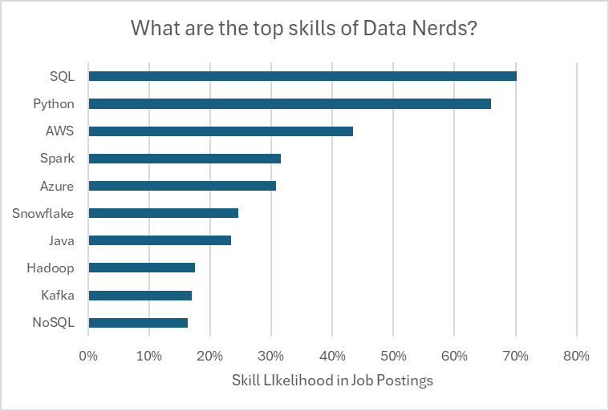

# 📊 Excel Data Analytics Project

An end-to-end Excel Data Analytics project built using real-world Data Science job posting data.

The project demonstrates how Microsoft Excel can be used as a complete Business Intelligence tool for data cleaning, data modeling, analysis, and dashboard creation without writing SQL or Python.

---

# Dashboard Preview


---

# Project Overview

The objective of this project is to analyze thousands of Data Science job postings to answer questions such as:

- Which job titles offer the highest salaries?
- Which employment type pays the most?
- Which countries have the highest-paying jobs?
- Which platform posts the most jobs?
- Which skills are most frequently requested?
- Do more technical skills lead to higher salaries?

The dashboard allows users to interactively filter the analysis by:

- Job Title
- Country
- Employment Type

---

# Dashboard Features

### ✔ Interactive Salary Dashboard

- Dynamic Dashboard
- Data Validation Drop-downs
- Interactive Charts
- KPI Cards
- Country Map
- Dynamic Median Salary
- Job Count
- Top Hiring Platform

---

## Dashboard Demo

### Complete Dashboard


---

### Country Filtering


---

### Data Validation


---

# Dashboard KPIs

The dashboard provides:

- 💰 Median Salary
- 🌍 Country Analysis
- 💼 Employment Type Analysis
- 📈 Salary by Job Title
- 📊 Total Job Count
- 🏢 Most Popular Job Platform

---

# Project Analysis

## 1. Do More Skills Increase Salary?


This scatter plot compares the median salary against the average number of skills requested in job postings. A positive trend suggests that jobs requiring more technical skills generally offer higher compensation.

---

## 2. Median Salary Comparison (US vs Non-US)


Comparison of median salaries across job roles for:

- United States
- Non-US Countries
- Overall Median Salary

---

## 3. Most Requested Skills



Top skills requested in Data Science job postings.

Highest demand skills include:

- SQL
- Python
- AWS
- Azure
- Spark

---

## 4. Top 10 Skills vs Salary


Comparison between:

- Median Salary
- Skill Demand

This chart highlights that some highly demanded skills don't necessarily provide the highest salaries, while specialized skills often command higher compensation.

---

# Tools Used

- Microsoft Excel
- Power Query
- Power Pivot
- DAX
- Pivot Tables
- Pivot Charts
- Data Validation
- Conditional Formatting
- Interactive Dashboard Design

---

# Excel Skills Demonstrated

### Data Cleaning

- Removed duplicates
- Handled missing values
- Standardized data

### Data Transformation

- Power Query
- Merge Queries
- Custom Columns
- Data Type Conversion

### Data Modeling

- Power Pivot
- Relationships
- Data Model

### DAX

- MEDIAN()
- COUNTROWS()
- CALCULATE()
- Measures
- Calculated Columns

### Visualization

- Pivot Charts
- Maps
- KPI Cards
- Dynamic Dashboard

---

# Key Insights

- Senior Data Scientist roles offer the highest median salaries.
- Full-time jobs dominate the market.
- SQL and Python remain the most requested technical skills.
- Jobs requiring a broader skill set generally pay more.
- Salary trends vary significantly across countries.

---

# Files Included

```
Excel_Project_Data_Analytics
│
├── Dashboard Workbook
├── Raw Dataset
├── Dashboard Images
├── Analysis Charts
└── README.md
```

---

# Author

**Piyush Khandelwal**

Aspiring Data Analyst

### Connect with me

- LinkedIn
- GitHub

---
